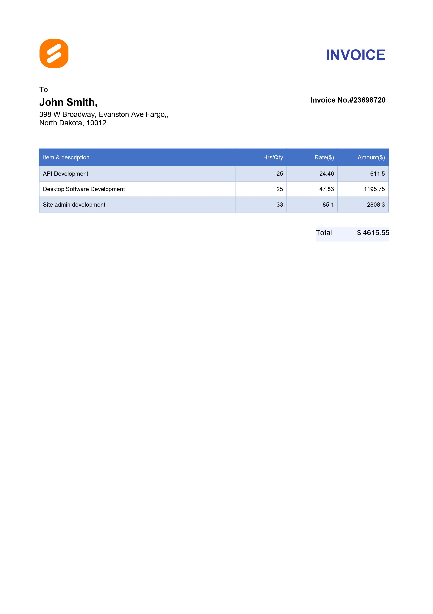

# How to Create a PDF Document in .NET Using the Syncfusion&reg; PDF Library

## Introduction
A quick start .NET console project that shows how to create a PDF document and add text, image, and table to it using the Syncfusion&reg; PDF Library.

## System requirement
**Framework and SDKs**
* .NET SDK (version 5.0 or later)

**IDEs**
*  Visual Studio 2019/ Visual Studio 2022

## Code snippet for simple PDF document with text, images, and tables
we will create a new .NET console application, add the Syncfusion&reg; PDF library package, and write the code

```csharp
    PdfDocument pdfDocument = new PdfDocument();
    PdfPage currentPage = pdfDocument.Pages.Add();
    SizeF clientSize = currentPage.GetClientSize();
    FileStream imageStream = new FileStream("../../../Data/icon.png", FileMode.Open, FileAccess.Read);
    PdfImage icon= new PdfBitmap(imageStream);
    SizeF iconSize = new SizeF(40, 40);
    PointF iconLocation = new PointF(14, 13);
    PdfGraphics graphics= currentPage.Graphics;
    graphics.DrawImage(icon,iconLocation,iconSize);
    PdfFont font = new PdfStandardFont(PdfFontFamily.Helvetica, 20, PdfFontStyle.Bold);
    var text = new PdfTextElement("INVOICE", font, new PdfSolidBrush(Color.FromArgb(1, 53, 67, 168)));
    text.StringFormat= new PdfStringFormat(PdfTextAlignment.Right);
    PdfLayoutResult result = text.Draw(currentPage, new PointF(clientSize.Width - 25, iconLocation.Y + 10));

    font = new PdfStandardFont(PdfFontFamily.Helvetica, 10);
    text = new PdfTextElement("To ", font);
    result = text.Draw(currentPage, new PointF(14, result.Bounds.Bottom + 30));
    font = new PdfStandardFont(PdfFontFamily.Helvetica, 14, PdfFontStyle.Bold);
    text = new PdfTextElement("John Smith,", font);
    result = text.Draw(currentPage, new PointF(14, result.Bounds.Bottom + 3));
    font = new PdfStandardFont(PdfFontFamily.Helvetica, 10);
    text = new PdfTextElement(string.Format("{0}, {1}", "398 W Broadway, Evanston Ave Fargo,", "\nNorth Dakota, 10012"), font);
    result = text.Draw(currentPage, new PointF(14, result.Bounds.Bottom + 3));

    font = new PdfStandardFont(PdfFontFamily.Helvetica, 10, PdfFontStyle.Bold);
    text = new PdfTextElement("Invoice No.#23698720 ", font);
    text.StringFormat = new PdfStringFormat(PdfTextAlignment.Right);
    text.Draw(currentPage, new PointF(clientSize.Width - 25, result.Bounds.Y - 20));

    PdfGrid grid=new PdfGrid();
    font= new PdfStandardFont(PdfFontFamily.Helvetica, 10, PdfFontStyle.Regular);
    grid.Style.Font = font;
    grid.Columns.Add(4);
    grid.Columns[1].Width = 70;
    grid.Columns[2].Width = 70;
    grid.Columns[3].Width = 70;

    grid.Headers.Add(1);
    PdfStringFormat stringFormat = new PdfStringFormat(PdfTextAlignment.Right, PdfVerticalAlignment.Middle);
    PdfGridRow header = grid.Headers[0];

    header.Cells[0].Value= "Item & description";
    header.Cells[0].StringFormat.LineAlignment = PdfVerticalAlignment.Middle;
    header.Cells[1].Value = "Hrs/Qty";
    header.Cells[1].StringFormat = stringFormat;
    header.Cells[2].Value = "Rate($)";
    header.Cells[2].StringFormat = stringFormat;
    header.Cells[3].Value = "Amount($)";
    header.Cells[3].StringFormat = stringFormat;

    PdfGridRow row = grid.Rows.Add();
    row.Cells[0].Value = "API Development";
    row.Cells[0].StringFormat.LineAlignment = PdfVerticalAlignment.Middle;

    row.Cells[1].Value = $"{25}";
    row.Cells[1].StringFormat = stringFormat;

    row.Cells[2].Value = $"{24.46}";
    row.Cells[2].StringFormat = stringFormat;

    decimal amount = (decimal)(25 * 24.46);
    row.Cells[3].Value = String.Format("{0:0.##}", amount);
    row.Cells[3].StringFormat = stringFormat;

    decimal sum = 0;
    sum += amount;

    row = grid.Rows.Add();
    row.Cells[0].Value = "Desktop Software Development";
    row.Cells[0].StringFormat.LineAlignment = PdfVerticalAlignment.Middle;
    row.Cells[1].Value = $"{25}";
    row.Cells[1].StringFormat = stringFormat;
    row.Cells[2].Value = $"{47.83}";
    row.Cells[2].StringFormat = stringFormat;
    amount = (decimal)(25 * 47.83);
    row.Cells[3].Value = String.Format("{0:0.##}", amount);
    row.Cells[3].StringFormat = stringFormat;

    sum += amount;

    row = grid.Rows.Add();
    row.Cells[0].Value = "Site admin development";
    row.Cells[0].StringFormat.LineAlignment = PdfVerticalAlignment.Middle;
    row.Cells[1].Value = $"{33}";
    row.Cells[1].StringFormat = stringFormat;
    row.Cells[2].Value = $"{85.1}";
    row.Cells[2].StringFormat = stringFormat;
    amount = (decimal)(33 * 85.1);
    row.Cells[3].Value = String.Format("{0:0.##}", amount);
    row.Cells[3].StringFormat = stringFormat;

    sum += amount;

    grid.ApplyBuiltinStyle(PdfGridBuiltinStyle.GridTable4Accent5);
    PdfGridStyle gridStyle = new PdfGridStyle();
    gridStyle.CellPadding = new PdfPaddings(5, 5, 5, 5);
    grid.Style= gridStyle;

    PdfGridLayoutFormat layoutFormat = new PdfGridLayoutFormat();
    layoutFormat.Layout = PdfLayoutType.Paginate;
    result = grid.Draw(currentPage, 14, result.Bounds.Bottom + 30, clientSize.Width - 35, layoutFormat);

    currentPage.Graphics.DrawRectangle(new PdfSolidBrush(Color.FromArgb(255, 239, 242, 255)),
        new RectangleF(result.Bounds.Right - 100, result.Bounds.Bottom + 20, 100, 20));

    PdfTextElement element = new PdfTextElement("Total", font);
    element.Draw(currentPage, new RectangleF(result.Bounds.Right - 100, result.Bounds.Bottom + 22, result.Bounds.Width, result.Bounds.Height));

    var totalPrice = $"$ {Math.Round(sum, 2)}";
    element=new PdfTextElement(totalPrice, font);
    element.StringFormat = new PdfStringFormat(PdfTextAlignment.Right);
    element.Draw(currentPage, new RectangleF(15, result.Bounds.Bottom + 22, result.Bounds.Width, result.Bounds.Height));

    MemoryStream stream = new MemoryStream();
    pdfDocument.Save(stream);
    pdfDocument.Close(true);
    stream.Position = 0;
    File.WriteAllBytes("Output.pdf",stream.ToArray());
```

**Output Image**


## How to run the examples
* Download this project to a location in your disk. 
* Open the solution file using Visual Studio. 
* Rebuild the solution to install the required NuGet package. 
* Run the application.

## Resources
*   **Product page:** [Syncfusion&reg; PDF Framework](https://www.syncfusion.com/document-processing/pdf-framework/net)
*   **Documentation page:** [Syncfusion&reg; .NET PDF library](https://help.syncfusion.com/file-formats/pdf/overview)
*   **Online demo:** [Syncfusion&reg; .NET PDF library - Online demos](https://ej2.syncfusion.com/aspnetcore/PDF/CompressExistingPDF#/bootstrap5)
*   **Blog:** [Syncfusion&reg; .NET PDF library - Blog](https://www.syncfusion.com/blogs/category/pdf)
*   **Knowledge Base:** [Syncfusion&reg; .NET PDF library - Knowledge Base](https://www.syncfusion.com/kb/windowsforms/pdf)
*   **EBooks:** [Syncfusion&reg; .NET PDF library - EBooks](https://www.syncfusion.com/succinctly-free-ebooks)
*   **FAQ:** [Syncfusion&reg; .NET PDF library - FAQ](https://www.syncfusion.com/faq/)

## Support and feedback
*   For any other queries, reach our [Syncfusion&reg; support team](https://www.syncfusion.com/support/directtrac/incidents/newincident?utm_source=github&utm_medium=listing&utm_campaign=github-docio-examples) or post the queries through the [community forums](https://www.syncfusion.com/forums?utm_source=github&utm_medium=listing&utm_campaign=github-docio-examples).
*   Request new feature through [Syncfusion&reg; feedback portal](https://www.syncfusion.com/feedback?utm_source=github&utm_medium=listing&utm_campaign=github-docio-examples).

## License
This is a commercial product and requires a paid license for possession or use. Syncfusion’s licensed software, including this component, is subject to the terms and conditions of [Syncfusion's EULA](https://www.syncfusion.com/eula/es/?utm_source=github&utm_medium=listing&utm_campaign=github-docio-examples). You can purchase a licnense [here](https://www.syncfusion.com/sales/products?utm_source=github&utm_medium=listing&utm_campaign=github-docio-examples) or start a free 30-day trial [here](https://www.syncfusion.com/account/manage-trials/start-trials?utm_source=github&utm_medium=listing&utm_campaign=github-docio-examples).

## About Syncfusion&reg;
Founded in 2001 and headquartered in Research Triangle Park, N.C., Syncfusion&reg; has more than 26,000+ customers and more than 1 million users, including large financial institutions, Fortune 500 companies, and global IT consultancies.

Today, we provide 1600+ components and frameworks for web ([Blazor](https://www.syncfusion.com/blazor-components?utm_source=github&utm_medium=listing&utm_campaign=github-docio-examples), [ASP.NET Core](https://www.syncfusion.com/aspnet-core-ui-controls?utm_source=github&utm_medium=listing&utm_campaign=github-docio-examples), [ASP.NET MVC](https://www.syncfusion.com/aspnet-mvc-ui-controls?utm_source=github&utm_medium=listing&utm_campaign=github-docio-examples), [ASP.NET WebForms](https://www.syncfusion.com/jquery/aspnet-webforms-ui-controls?utm_source=github&utm_medium=listing&utm_campaign=github-docio-examples), [JavaScript](https://www.syncfusion.com/javascript-ui-controls?utm_source=github&utm_medium=listing&utm_campaign=github-docio-examples), [Angular](https://www.syncfusion.com/angular-ui-components?utm_source=github&utm_medium=listing&utm_campaign=github-docio-examples), [React](https://www.syncfusion.com/react-ui-components?utm_source=github&utm_medium=listing&utm_campaign=github-docio-examples), [Vue](https://www.syncfusion.com/vue-ui-components?utm_source=github&utm_medium=listing&utm_campaign=github-docio-examples), and [Flutter](https://www.syncfusion.com/flutter-widgets?utm_source=github&utm_medium=listing&utm_campaign=github-docio-examples)), mobile ([Xamarin](https://www.syncfusion.com/xamarin-ui-controls?utm_source=github&utm_medium=listing&utm_campaign=github-docio-examples), [Flutter](https://www.syncfusion.com/flutter-widgets?utm_source=github&utm_medium=listing&utm_campaign=github-docio-examples), [UWP](https://www.syncfusion.com/uwp-ui-controls?utm_source=github&utm_medium=listing&utm_campaign=github-docio-examples), and [JavaScript](https://www.syncfusion.com/javascript-ui-controls?utm_source=github&utm_medium=listing&utm_campaign=github-docio-examples)), and desktop development ([WinForms](https://www.syncfusion.com/winforms-ui-controls?utm_source=github&utm_medium=listing&utm_campaign=github-docio-examples), [WPF](https://www.syncfusion.com/wpf-ui-controls?utm_source=github&utm_medium=listing&utm_campaign=github-docio-examples), [WinUI(Preview)](https://www.syncfusion.com/winui-controls?utm_source=github&utm_medium=listing&utm_campaign=github-docio-examples), [Flutter](https://www.syncfusion.com/flutter-widgets?utm_source=github&utm_medium=listing&utm_campaign=github-docio-examples) and [UWP](https://www.syncfusion.com/uwp-ui-controls?utm_source=github&utm_medium=listing&utm_campaign=github-docio-examples)). We provide ready-to-deploy enterprise software for dashboards, reports, data integration, and big data processing. Many customers have saved millions in licensing fees by deploying our software.